# Manual de usuario — Óptica Paracao

> Guía para usuarios finales. Versión revisada contra la aplicación y su navegación actual (agosto de 2026).

## 1. Acceso al sistema

Óptica Paracao es una aplicación web y no requiere instalar programas, Node.js ni dependencias. Para usarla, abra un navegador actualizado e ingrese directamente a [https://opticagestionparacao.lnx.com.ar](https://opticagestionparacao.lnx.com.ar), o utilice el enlace web entregado por el administrador.

Requisitos: conexión a Internet, un navegador moderno —como Chrome, Edge, Firefox o Safari— y las credenciales asignadas. No descargue instaladores ni ejecute comandos para acceder al sistema.

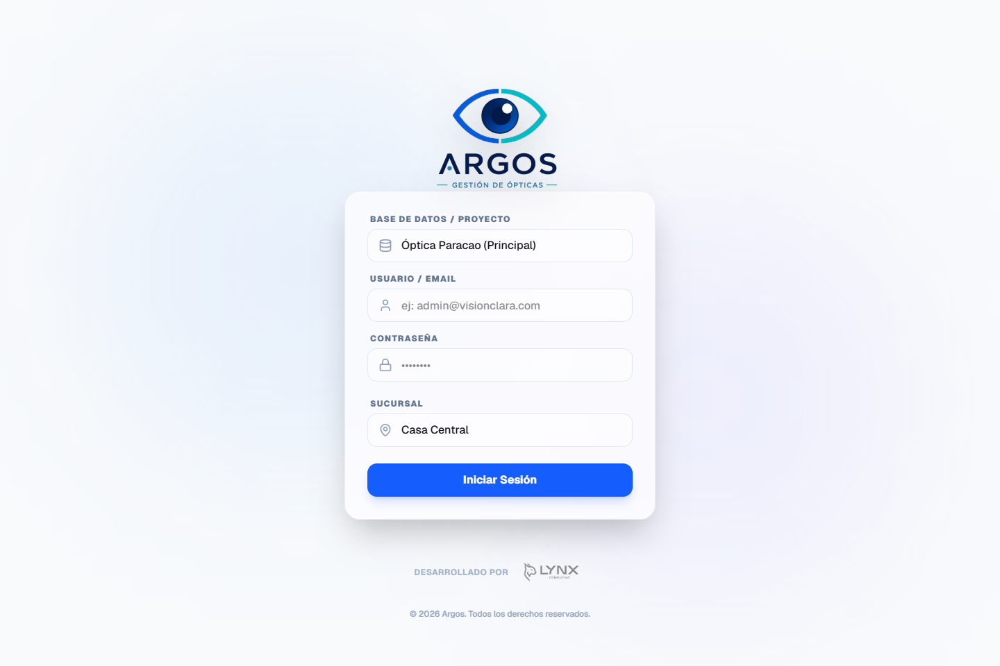

1. Escriba su **Usuario o Email**.
2. Ingrese la **Contraseña**.
3. Seleccione la **Sucursal** en la que registrará las operaciones.
4. Pulse **Ingresar al Sistema**.

Buenas prácticas: use su propia cuenta, verifique la sucursal antes de cargar datos y cierre sesión al terminar. Evite compartir contraseñas o dejar una sesión abierta en un equipo común. Si el ingreso falla, revise mayúsculas, conexión y sucursal; después contacte al administrador.

## 2. Navegación general

Después de ingresar se muestra el **Panel de Control**. El menú lateral contiene: **Inicio, Clientes, Ventas Rápidas, Pedidos, Stock, Proveedores, Laboratorios, Caja/Finanzas, Borradores Facturación, Reportes, CRM & Marketing, Ajustes y Ayuda**.

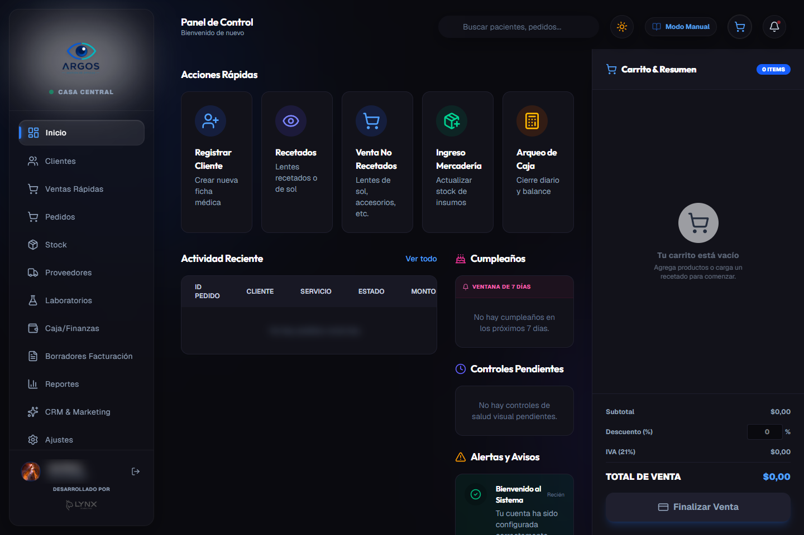

La barra superior permite usar la búsqueda, revisar notificaciones, cambiar tema claro/oscuro y abrir el perfil. En pantallas pequeñas, el menú se abre con el botón de tres líneas. En **Ayuda** está el manual guiado e interactivo.

## 3. Inicio

Use **Inicio** para revisar indicadores y alertas antes de operar: ventas, pedidos o trabajos pendientes, stock y situación de caja. Los accesos rápidos llevan a las tareas habituales.

Buena práctica: revise las alertas al comenzar el turno. Evite interpretar una tarjeta como cierre contable definitivo; confirme los datos en el módulo correspondiente.

## 4. Clientes

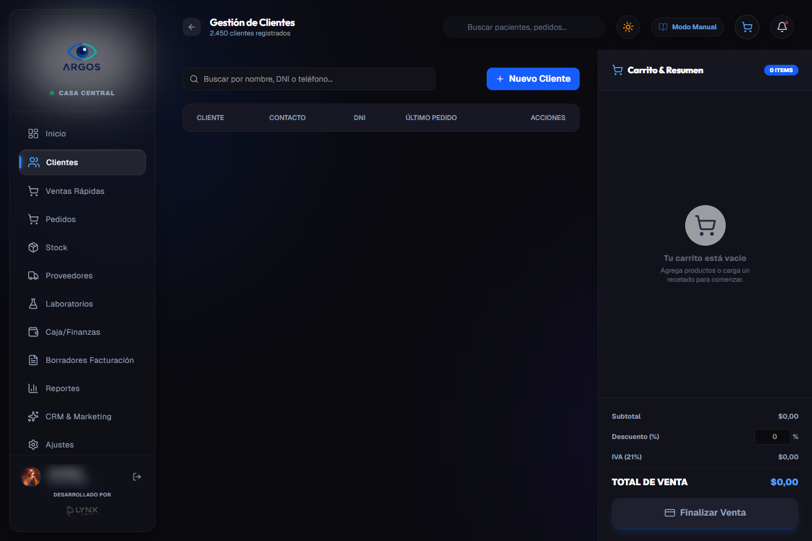

### Registrar un cliente

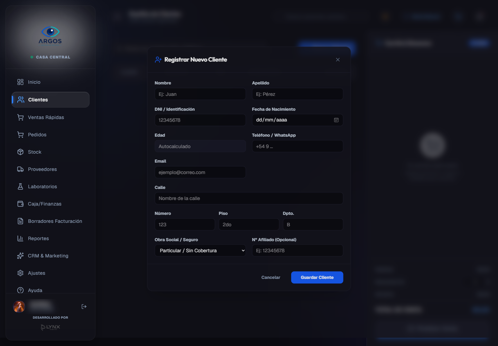

1. Abra **Clientes** y pulse **Registrar Cliente**.
2. Complete DNI, nombre y apellido, teléfono/WhatsApp, email y domicilio cuando corresponda.
3. Seleccione obra social/cobertura e ingrese el número de afiliado si aplica.
4. Revise los datos y pulse **Guardar Cliente**.

Buenas prácticas: busque primero por DNI para no duplicar personas; copie el documento sin espacios erróneos; confirme el teléfono antes de usarlo para avisos. Evite inventar datos obligatorios o guardar una ficha duplicada.

El formulario calcula la edad desde la fecha de nacimiento. La dirección se divide en calle, número, piso y departamento. Si existe cobertura, seleccione **Obra Social / Seguro** y cargue el número de afiliado. Si el sistema advierte que el DNI ya existe, cancele el alta y abra la ficha existente. Los nombres con tildes, eñes y símbolos habituales deben escribirse normalmente.

Desde la lista se puede buscar, editar la ficha, consultar historial, pedidos y cuenta corriente. Para asentar un cobro, abra la cuenta corriente, verifique saldo, monto, medio de pago y caja de destino antes de confirmar.

### Buscar, editar e historial

- Busque por nombre completo, parte del nombre, DNI o teléfono.
- Use **Editar** para corregir contacto, dirección o cobertura; revise antes de guardar.
- Abra el historial para comparar pedidos y recetas por fecha, tipo, importe y graduación.
- No elimine clientes con operaciones asociadas. Si existe esa opción, lea la advertencia y preserve el historial.
- Para una seña o pago parcial, compruebe que el recibo muestre cliente, importe, medio y caja correctos.

## 5. Ventas Rápidas

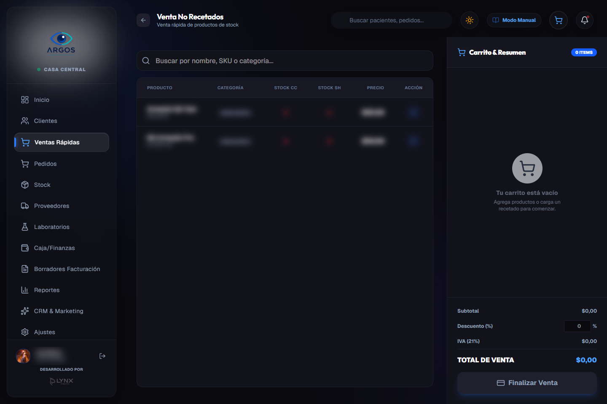

Se usa para productos **no recetados**: lentes de sol, líquidos, estuches y accesorios.

1. Busque por nombre, SKU o categoría, o escanee el código.
2. Agregue el producto al carrito y ajuste la cantidad.
3. Abra el carrito, revise artículos, precios, descuentos y total.
4. Seleccione cliente si corresponde, medio de pago y confirme el cobro.

Buenas prácticas: compruebe SKU, cantidad y stock físico. Evite usar Venta Rápida para un trabajo con graduación; esos casos se cargan en **Pedidos**.

El carrito admite descuentos porcentuales. Revise que el total actualizado sea correcto y que el descuento esté autorizado; nunca ingrese porcentajes negativos o superiores al máximo permitido. Una venta por transferencia debe impactar en la cuenta bancaria o digital seleccionada, no en Caja Efectivo. Después de confirmar, verifique el comprobante antes de imprimirlo.

## 6. Pedidos — anteojos recetados

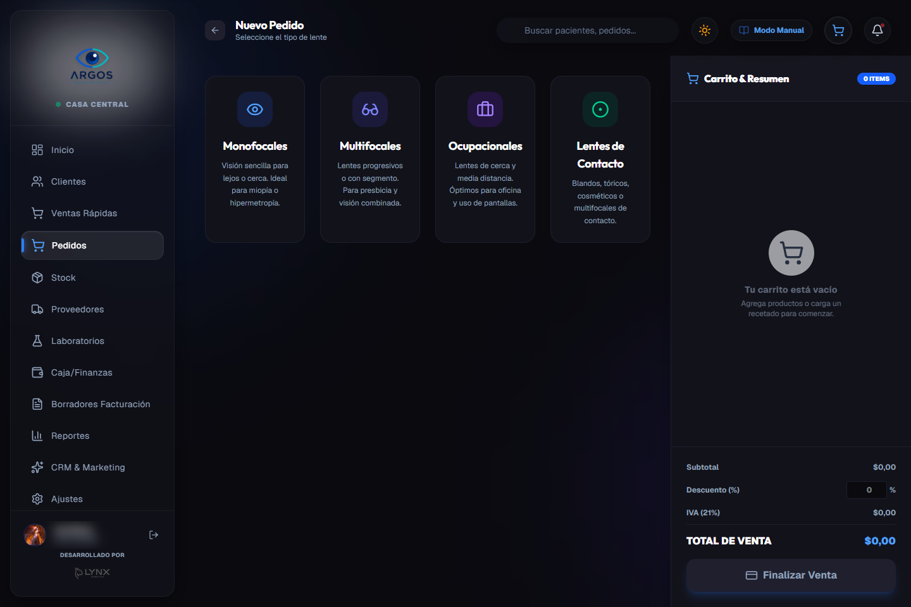

El nombre exacto del módulo es **Pedidos**. La pantalla inicial muestra tipos de trabajo y la carga técnica se abre como **Detalle de Pedido**. El pedido se agrega al carrito antes de completar el cobro o la seña.

### Carga paso a paso

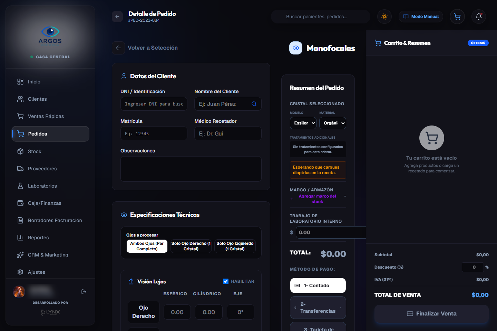

1. Abra **Pedidos** y elija el tipo correcto: **Monofocal, Bifocal, Multifocal/Ocupacional o Contactología**, según lo que muestre la receta.
2. Seleccione un cliente existente. Si no existe, regístrelo primero en **Clientes**.
3. Transcriba la receta separando **OD** (ojo derecho) y **OI** (ojo izquierdo):
   - **ESF/Esfera**: potencia positiva o negativa.
   - **CIL/Cilindro**: corrección del astigmatismo.
   - **EJE**: orientación entre 0° y 180°.
   - **ADD/Adición**: visión cercana; se usa en multifocales/bifocales.
   - **DP/DI/DNP**: distancia pupilar o nasopupilar, en milímetros.
   - **Altura**: medida de montaje, especialmente importante en multifocales.
4. Elija las especificaciones disponibles: material, índice, diseño, color y tratamientos.
5. Seleccione el armazón por SKU desde Stock o indique que el cliente trae armazón propio.
6. Seleccione el laboratorio cuando el trabajo requiera derivación.
7. Revise precio, descuento autorizado, fecha prometida y observaciones técnicas.
8. Pulse **Agregar al Carrito**. En el carrito, verifique el resumen, total, seña, saldo y medio de pago antes de confirmar.

Ejemplo de transcripción (solo ilustrativo): OD ESF `-2.00`, CIL `-0.50`, EJE `180°`; OI ESF `-1.75`, CIL `-0.75`, EJE `175°`; DI `63 mm`. En un multifocal puede agregarse ADD `+2.00` y altura `18 mm`. Use siempre los valores reales de la receta, no este ejemplo.

Advertencias importantes:

- No intercambie OD y OI.
- Respete los signos `+` y `-`; un signo incorrecto cambia la graduación.
- No confunda DI total con DNP monocular.
- No estime ADD, eje ni altura. Si son ilegibles o faltan, detenga la carga y consulte al profesional responsable.
- Antes de agregar al carrito, haga una segunda lectura comparando pantalla y receta original.
- No confirme cobros, señas ni envíos a laboratorio durante una consulta o prueba.
- Las graduaciones fuera del rango habitual (por ejemplo, mayores a ±30.00) requieren revisión y pueden mostrar una advertencia; no la ignore automáticamente.
- Compruebe que el cristal elegido admita la graduación cargada. Si aparece “fuera de rango”, seleccione un cristal compatible o consulte al responsable técnico.
- Para un solo ojo, seleccione **Solo Ojo Derecho** o **Solo Ojo Izquierdo** y confirme que el precio corresponda a un cristal, no a dos.

Para corregir antes del cobro, use la opción de editar del carrito. Para seguimiento, consulte el estado del pedido y avance solo cuando el trabajo realmente cambie de etapa.

### Multifocales y bifocales

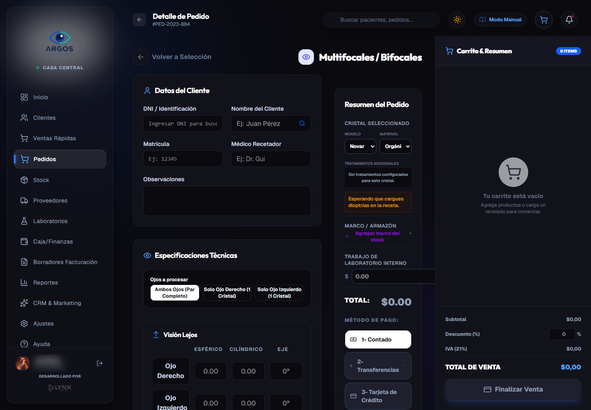

Además de ESF, CIL y EJE de lejos, cargue las adiciones de OD y OI, DNP de lejos y cerca y altura de montaje. Como control general, la DNP de cerca suele ser menor o igual que la de lejos. Una adición fuera del rango habitual debe revisarse contra la receta. Seleccione el diseño multifocal y compruebe que el resumen identifique el trabajo como **Multifocal/Bifocal**.

### Lentes de contacto

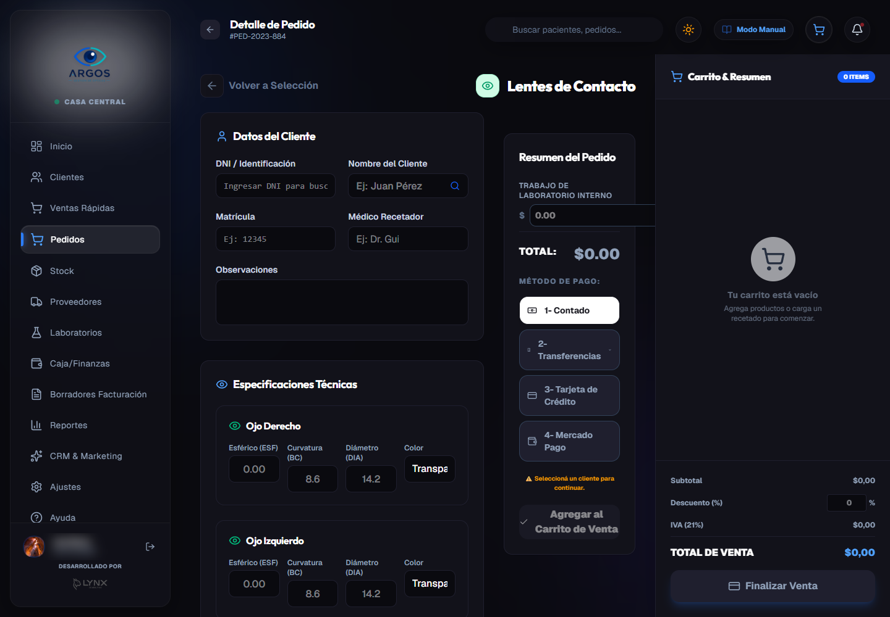

1. En **Pedidos**, elija **Lentes de Contacto**.
2. Seleccione el cliente y complete médico/matrícula si corresponde.
3. Para OD y OI cargue **Esférico (ESF)**, **Curvatura (BC)**, **Diámetro (DIA)** y color.
4. Revise marca, tipo o frecuencia de reemplazo cuando estén disponibles.
5. Compare ambos ojos con la indicación y recién entonces agregue al carrito.

Como referencia de formato, BC puede verse como `8.60` y DIA como `14.20`; no use esos valores como receta. Respete signos negativos y no sustituya medidas faltantes por valores “típicos”.

### Envío y seguimiento de laboratorio

Seleccione el laboratorio, fecha prometida y observaciones técnicas. La tarjeta de laboratorio debe contener cliente, graduación, tipo de trabajo, armazón y fecha. En **Laboratorios**, filtre y busque trabajos; cambie el estado en la secuencia operativa real (pendiente, en taller, listo, entregado). No marque **Entregado** hasta confirmar entrega y saldo.

## 7. Stock

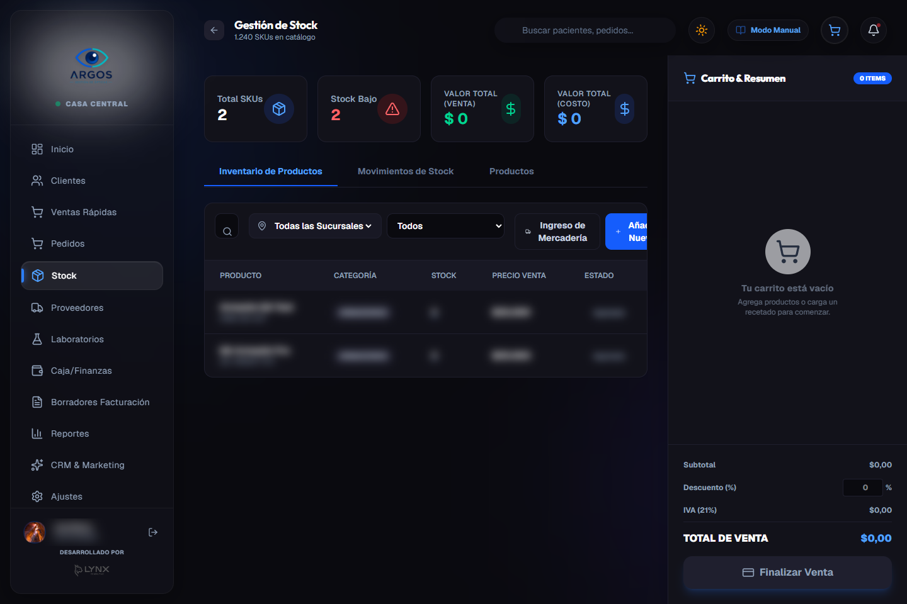

### Alta o actualización

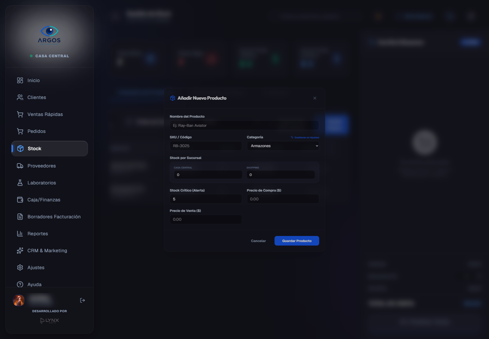

1. Abra **Stock** y pulse la acción de nuevo artículo.
2. Complete SKU único, descripción/modelo, marca, categoría, costo, precio de venta, stock inicial y stock mínimo.
3. Revise y guarde.

Para una entrega de proveedor use **Recepción de Mercadería**: seleccione proveedor, identifique cada SKU, cargue unidades y confirme el ingreso. Buenas prácticas: cuente físicamente, coteje remito y preserve un SKU único. Evite corregir diferencias inventando una recepción.

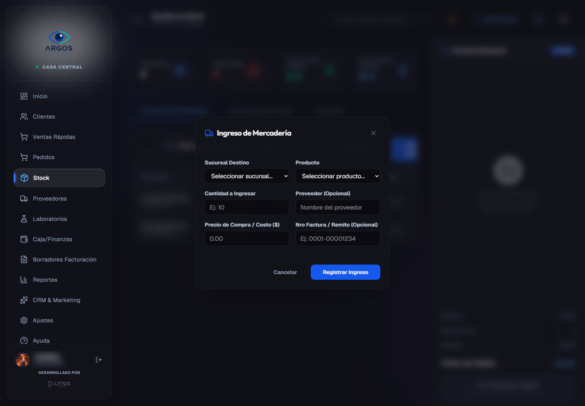

### Movimientos y controles de stock

- **Ingreso de Mercadería:** aumenta stock y debe respaldarse con proveedor, remito o factura.
- **Registrar Egreso:** úselo para rotura, pérdida, devolución u otra salida justificada; indique cantidad y motivo.
- **Mover Stock:** seleccione origen, destino y cantidad. El sistema debe impedir transferir más unidades que las disponibles.
- **Filtros:** combine búsqueda, categoría y sucursal; limpie filtros antes de concluir que un producto no existe.
- **Precios:** costo y venta no pueden ser negativos. Si el formulario los acepta, no confirme y reporte el problema.
- **Eliminación:** solo con autorización y después de revisar movimientos asociados; prefiera inactivar cuando el historial deba preservarse.

## 8. Proveedores

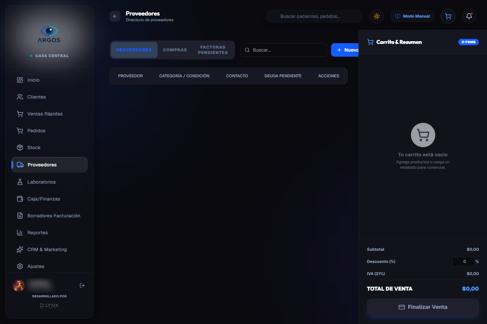

Permite administrar el directorio, compras, cuenta corriente y facturas pendientes.

### Registrar proveedor o compra

Para un proveedor, complete código, razón social, CUIT, categoría, condición de pago, contacto y datos bancarios. Para una compra, pulse **Cargar Nueva Compra**, elija proveedor y cargue tipo/número de comprobante, fechas, condición, importes, vencimiento y observaciones.

Buenas prácticas: controle CUIT y número contra la factura, evite duplicar comprobantes y verifique vencimiento. Use **Pagar Factura** solo al registrar un pago realmente realizado y confirme la cuenta de salida.

## 9. Laboratorios

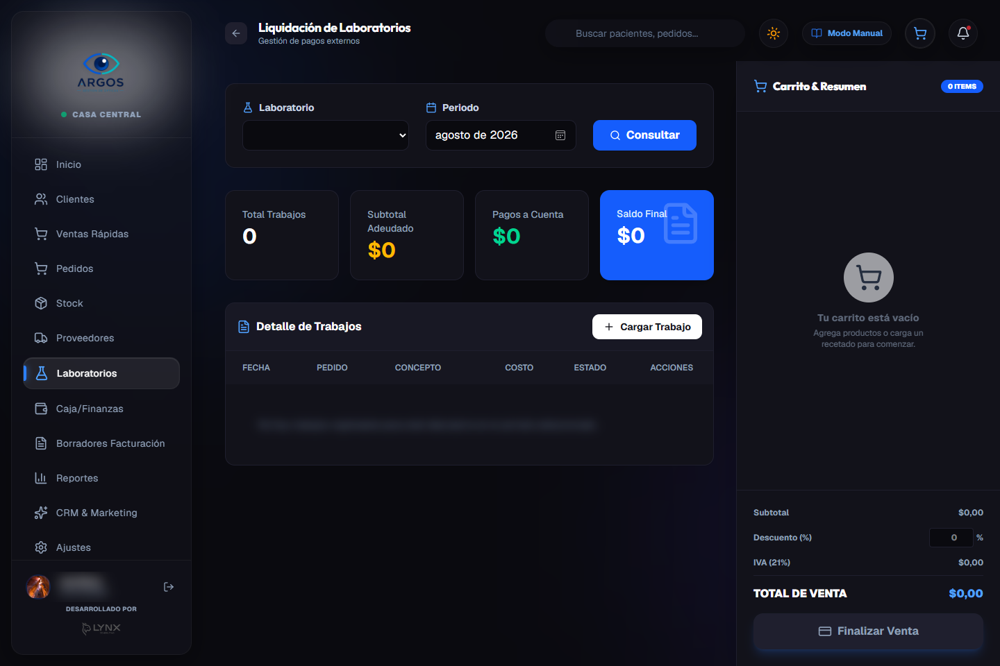

Muestra trabajos derivados y permite controlar su liquidación. Busque el laboratorio, revise pedidos incluidos, importes y estados. Cambie un estado únicamente cuando exista respaldo del taller o laboratorio. Evite liquidar dos veces el mismo trabajo o marcar como recibido un pedido aún en tránsito.

## 10. Caja/Finanzas

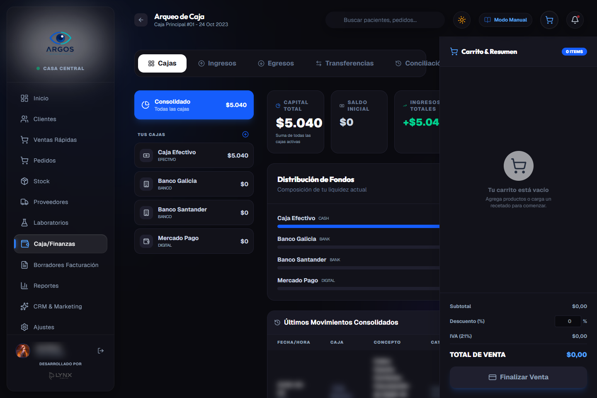

Incluye cajas, movimientos, transferencias, arqueo y conciliación bancaria.

### Movimiento o cierre de caja

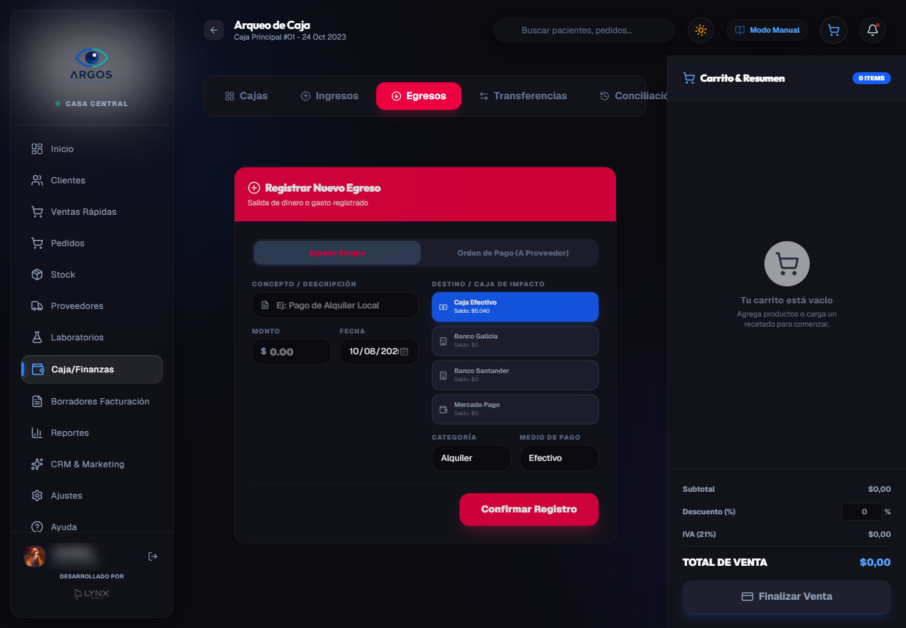

Seleccione la caja correcta, cargue tipo de movimiento, importe, concepto y referencia. En el arqueo, compare saldo teórico con efectivo contado y explique cualquier diferencia antes de cerrar.

Para un egreso simple, cargue concepto, caja de impacto, monto, fecha, categoría y medio de pago. Para pagos a proveedores, use **Orden de Pago (A Proveedor)** cuando corresponda. Antes de confirmar, revise que el saldo de la caja elegida alcance y que el comprobante quede asociado.

### Conciliación bancaria

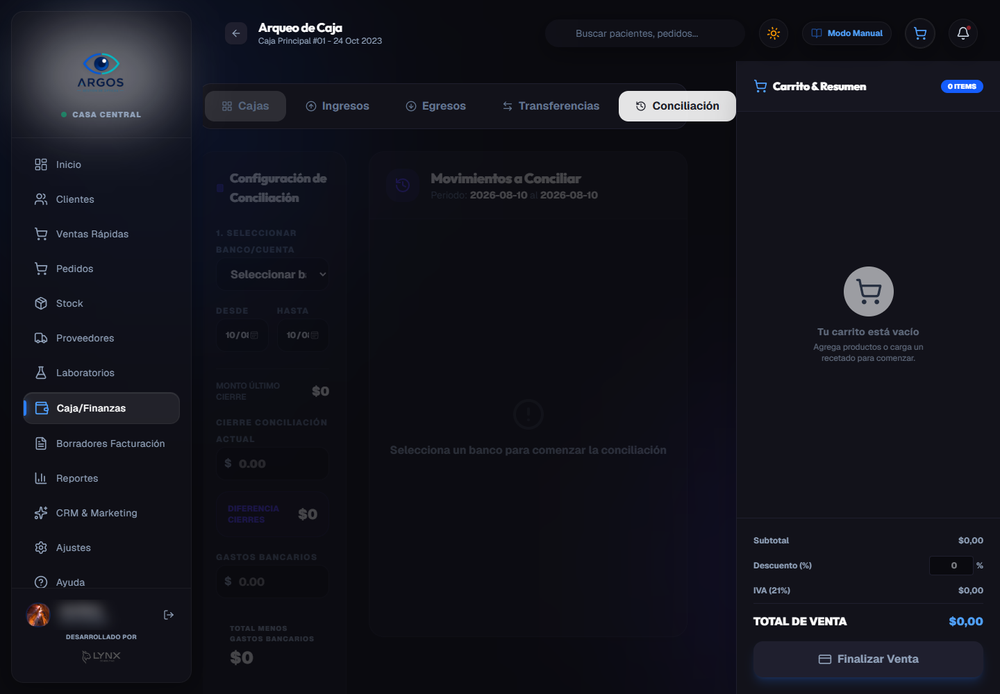

1. Seleccione banco/cuenta y período.
2. Ingrese el saldo de cierre del extracto.
3. Marque únicamente movimientos que coincidan con el extracto.
4. Registre gastos bancarios documentados.
5. Cierre solo cuando la diferencia sea `$0,00` o haya una explicación autorizada.

Evite usar una caja o cuenta equivocada, redondear diferencias o conciliar sin extracto.

### Anulaciones e impresión

Una anulación debe dejar la operación identificada como anulada y revertir el saldo de la caja correspondiente; no borre movimientos para “corregirlos”. Después de una venta o cobro, el comprobante imprimible debe mostrar cliente, detalle, fecha, total y número de operación.

## 11. Borradores Facturación

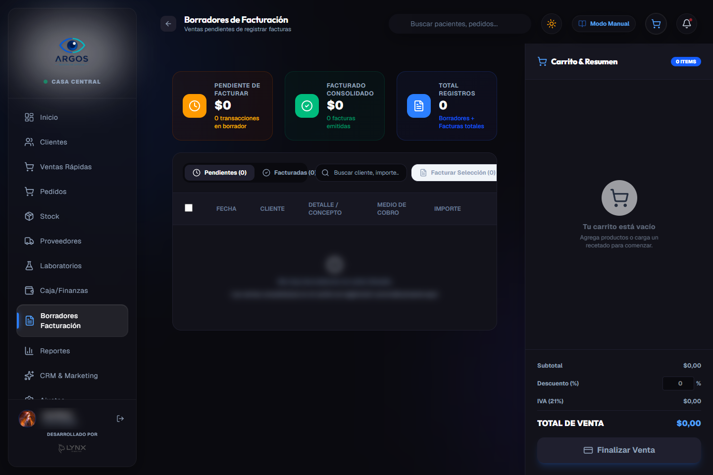

Lista ventas pendientes de facturación. Abra un borrador, revise cliente, condición fiscal, detalle e importes; seleccione tipo de comprobante y punto de venta. **Procesar Factura** puede generar un comprobante fiscal: ejecútelo solo con autorización y datos verificados. Evite procesar dos veces o emitir con CUIT/condición IVA incorrectos.

## 12. Reportes

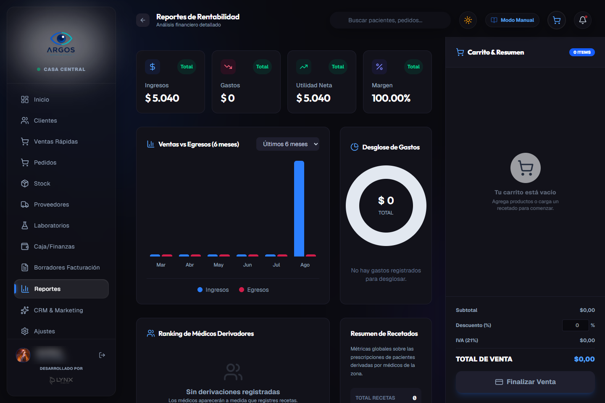

Permite consultar rentabilidad y otros análisis por período. Defina fechas y filtros, revise totales y exporte si la pantalla lo ofrece. Los reportes dependen de la calidad de las cargas; ante una diferencia, revise ventas, costos, caja y facturación de origen.

## 13. CRM & Marketing

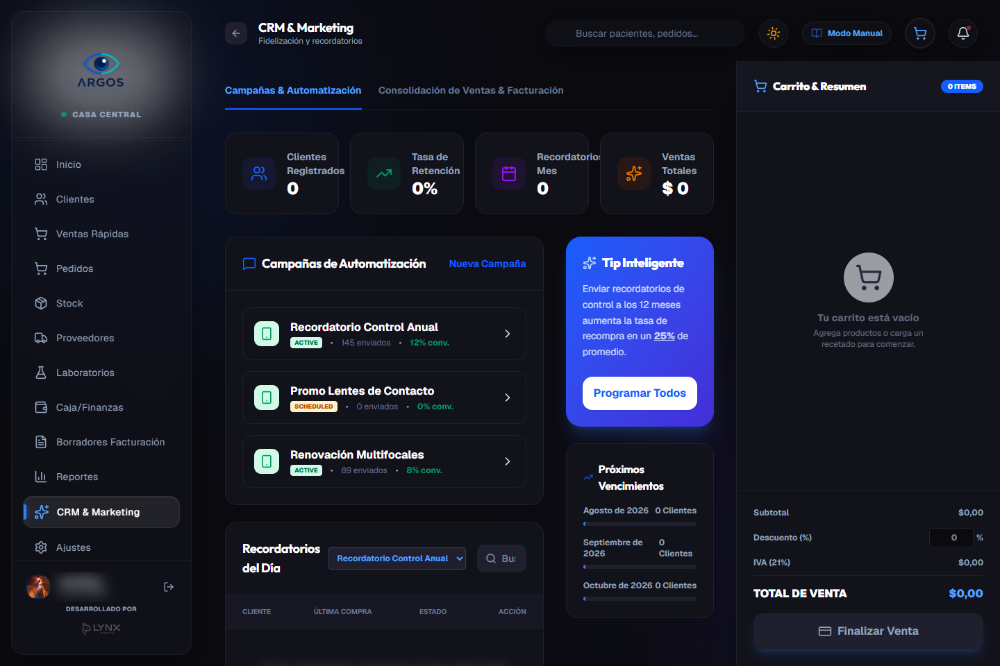

Permite buscar clientes, revisar recordatorios y preparar campañas. Verifique destinatarios, plantilla, variables como `{nombre_cliente}` y contenido antes de cualquier envío. No envíe mensajes sin consentimiento, no incluya datos clínicos o financieros y haga una prueba con un destinatario interno cuando sea posible.

## 14. Ajustes

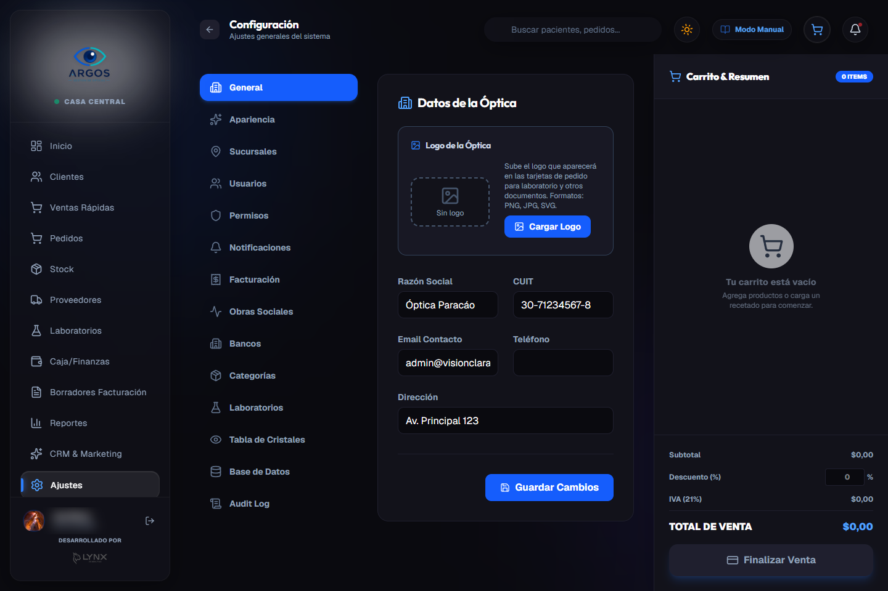

Reúne empresa, tema, sucursales, usuarios, bancos, laboratorios, categorías, catálogos de lentes, obras sociales, conexiones y parámetros fiscales. Estos cambios afectan a otros módulos: deben realizarlos usuarios autorizados. Nunca pegue claves, certificados o credenciales en capturas o comunicaciones.

### Usuarios y permisos

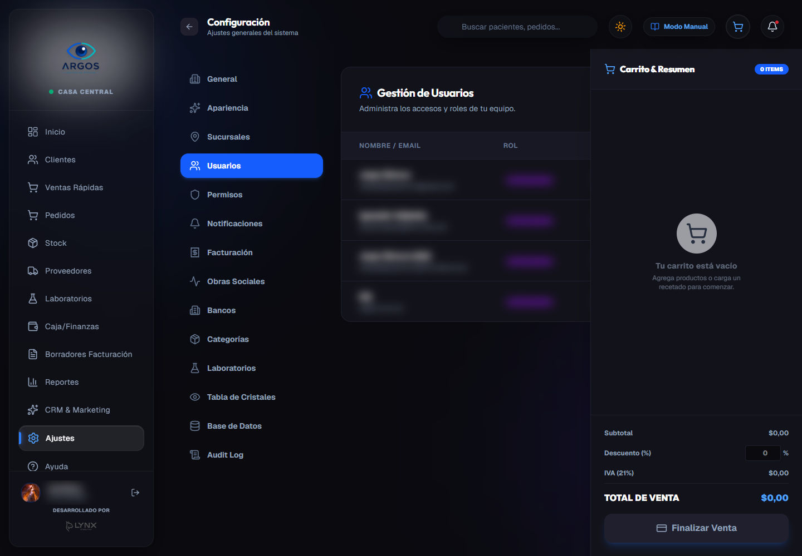

Los administradores pueden crear usuarios, asignar rol, sucursal predeterminada y permisos. Use cuentas individuales, otorgue el mínimo acceso necesario y desactive accesos que ya no correspondan. Nunca comparta una cuenta administrativa.

### Obras sociales y coberturas

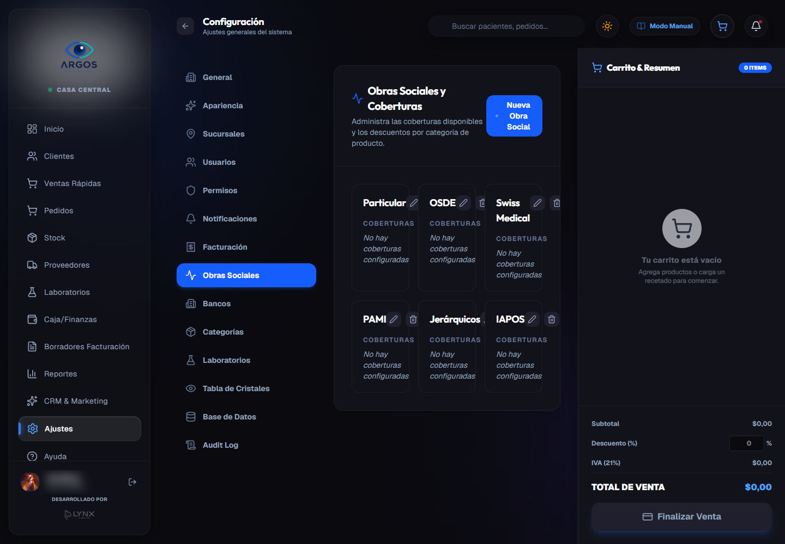

Registre nombre, código y coberturas o descuentos aplicables. Antes de guardar, confirme si la cobertura corresponde a cristales, armazones u otra categoría. Los cambios afectan los totales de pedidos posteriores.

### Bancos y cajas digitales

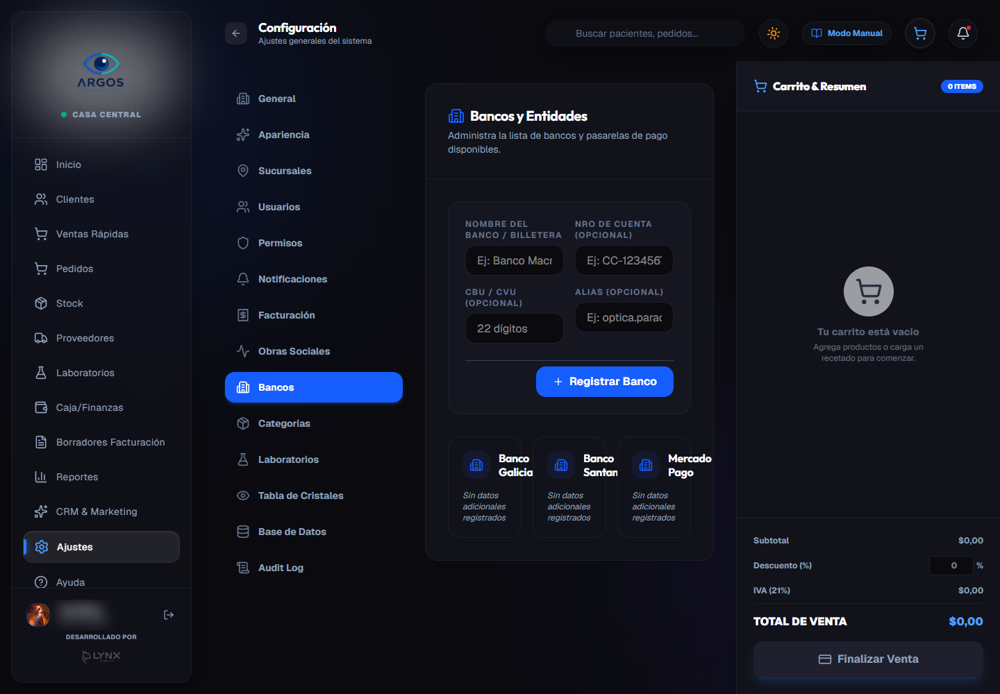

Mantenga nombre, cuenta, CBU y alias actualizados. Una entidad nueva debe aparecer después como destino de transferencias y conciliaciones. Verifique especialmente que no se confundan cuentas de distintas sucursales.

### Tabla de cristales

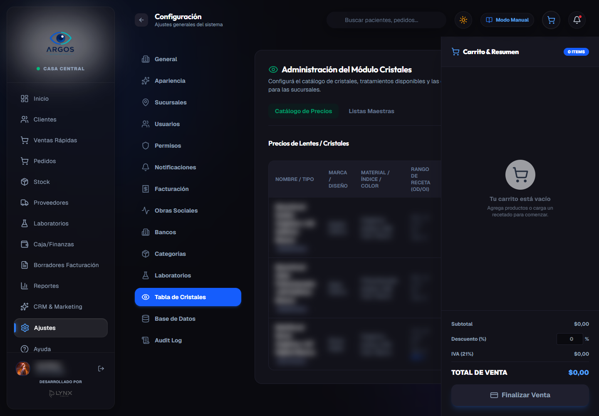

Configure nombre, tipo, marca, material, índice, diseño, color, precio y rangos de receta. Los límites de esfera y cilindro determinan las advertencias al cargar pedidos; no amplíe un rango sin confirmación del proveedor o responsable técnico.

### Audit Log

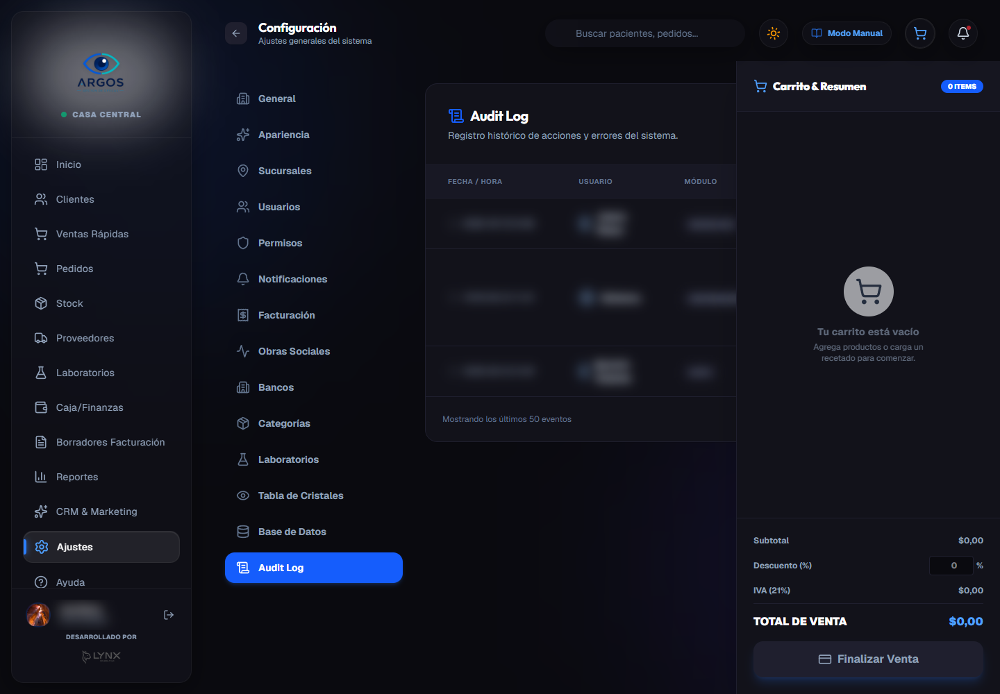

El **Audit Log** es de consulta: permite revisar usuario, fecha/hora, acción y resultado. Úselo para investigar diferencias o reconstruir quién realizó un cambio. No debe editarse ni usarse para exponer datos sensibles.

## 15. Ayuda

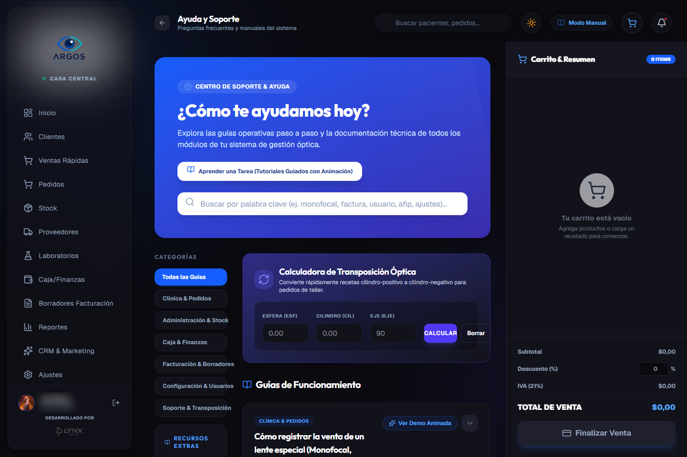

Incluye preguntas frecuentes y un manual guiado. El modo interactivo explica botones y campos al pasar el cursor. Úselo para practicar navegación, pero no confirme operaciones reales durante una capacitación.

## 16. Solución de problemas

| Problema | Qué revisar |
|---|---|
| No puedo ingresar | Usuario/email, contraseña, sucursal, conexión y estado de la cuenta. |
| No aparece un cliente | Busque por DNI y por nombre; confirme sucursal y filtros. |
| No puedo agregar un producto | Revise stock, SKU, cantidad y campos obligatorios. |
| El pedido recetado no avanza | Revise campos técnicos, cliente, armazón, laboratorio y estado del carrito. |
| Caja no coincide | Compare movimientos, anulaciones, medios de pago y conteo físico; no cierre hasta explicar la diferencia. |
| Factura rechazada | Revise conexión fiscal, punto de venta, tipo, CUIT, condición IVA e importes. No reintente a ciegas. |
| La pantalla queda vacía | Recargue una vez, compruebe conexión y vuelva a iniciar sesión. Si persiste, informe pantalla, hora y acción previa sin compartir contraseñas. |
| Aparece “DNI duplicado” | Cancele el alta y busque la ficha existente antes de crear otro cliente. |
| No permite mover stock | Revise sucursal de origen, cantidad disponible y que el destino sea diferente del origen. |
| La receta muestra “fuera de rango” | Compare graduación con el rango del cristal y seleccione uno compatible; no omita la advertencia. |
| Una transferencia impactó en efectivo | No duplique la operación. Informe el movimiento y siga el procedimiento autorizado de anulación o corrección. |
| La sesión muestra datos de otra sucursal | Detenga la carga, confirme sucursal activa y vuelva a iniciar sesión si es necesario. |

Al pedir soporte, indique módulo, sucursal, fecha/hora, mensaje exacto y pasos realizados. Oculte DNI, teléfonos, datos bancarios, recetas y credenciales en cualquier captura.

## 17. Lista de control antes de guardar

- Estoy en la sucursal y módulo correctos.
- Busqué registros existentes para evitar duplicados.
- Revisé campos obligatorios, fechas, signos, importes y unidades.
- Comparé contra el documento fuente.
- Entiendo si la acción solo guarda un borrador o produce un efecto real (stock, caja, cuenta corriente, laboratorio o factura).
- Tengo autorización para confirmar la operación.

## 18. Seguridad y uso responsable

- Cierre sesión desde el perfil; no dependa únicamente de cerrar la pestaña.
- Después de cerrar sesión, las rutas internas no deberían mostrar información. Si ocurre, informe el incidente.
- No copie datos clínicos, personales, bancarios o fiscales en chats o capturas sin sanitizarlos.
- No pruebe textos maliciosos, datos ficticios ni casos QA en producción. Esas verificaciones corresponden a un entorno aislado.
- En tablet o celular, confirme que puede ver el formulario completo y el botón de acción antes de comenzar una carga extensa.
