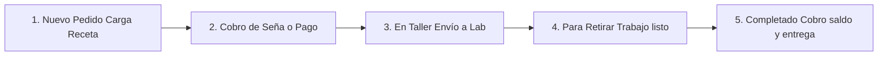

# 4. Gestión de Pedidos y Recetas Ópticas

---

## 4.1. Objetivo del Módulo

El módulo de **Pedidos y Recetas Ópticas** es el corazón operativo del sistema. Su objetivo es registrar con precisión técnica las recetas oftálmicas prescritas por los médicos oculistas (cristales Monofocales, Multifocales, Bifocales o Lentes de Contacto), vincular el armazón seleccionado, cobrar la seña o pago total, y dar seguimiento logístico a la calibración del cristal en laboratorio externo hasta la entrega final al paciente.

---

## 4.2. Estructura Visual del Formulario de Recetas

La interfaz de carga de pedidos organiza los parámetros refractivos, montajes y cobros en una pantalla limpia e intuitiva:

---

## 4.3. Explicación Detallada de Campos y Parámetros Técnicos

### A. Datos Generales de la Orden

| Nombre del Campo | Tipo de Dato | Propósito y Definición | Obligatorio |
| :--- | :--- | :--- | :--- |
| **Cliente / Paciente** | Selector / Busca | Selecciona al cliente previamente registrado por DNI o Nombre. | **Sí** |
| **Médico Oftalmólogo**| Texto libre | Nombre y matrícula del profesional emisor de la receta. | Recomendado |
| **Fecha de Receta** | Fecha | Día en que el médico realizó la prescripción oftálmica. | **Sí** |
| **Fecha de Promesa** | Fecha | Día estipulado con el cliente para el retiro en sucursal. | **Sí** |

### B. Parámetros de Refracción (Ojo Derecho - OD y Ojo Izquierdo - OI)

| Parámetro Taller | Rango / Formato | Propósito y Explicación Técnica |
| :--- | :--- | :--- |
| **Esférico (ESF)** | +/- 0.00 a +/- 20.00 | Mide la miopía (valores negativos `-`) o hipermetropía (valores positivos `+`). |
| **Cilíndrico (CIL)** | Negativo (ej. -0.75) | Mide el astigmatismo del cristal. |
| **Eje (EJE)** | 0° a 180° | Orientación del astigmatismo en grados sexagesimales. |
| **Adición (ADD)** | +0.75 a +3.50 | Graduación adicional para presbicia (visión cercana), usada en Multifocales y Bifocales. |
| **Distancia Pupilar (DP/DNP)**| mm (ej. 31/32 mm) | Distancia desde el centro de la nariz a cada pupila. Vital para centrar los cristales. |
| **Altura de Montaje** | mm (ej. 18 mm) | Exclusivo multifocales: distancia desde la pupila al borde inferior del armazón. |

### C. Especificaciones de Cristales y Armazón

- **Tipo de Cristal**: Desplegable (*Monofocal, Bifocal, Multifocal / Progresivo, Lente de Contacto*).
- **Material**: Material del lente (*Orgánico, Mineral, Policarbonato, Alto Índice 1.67/1.74*).
- **Tratamientos**: Capas aplicadas (*Antirreflex, Filtro Blue Light / Luz Azul, Fotocromático / PhotoGray, Polarizado*).
- **Armazón**: Selección directa del stock de la óptica por SKU/Código o `Armazón propio del cliente` (si trae el suyo para cambio de cristales).

---

## 4.4. Circuito Logístico y Estados del Pedido

Un encargo atraviesa automáticamente las siguientes etapas visuales:

1. **En Taller**: El pedido fue ingresado y los datos de refracción se enviaron al laboratorio óptico contratado.
2. **Para Retirar**: El cristal fue calibrado y montado en el armazón. Se encuentra en la sucursal listo para entrega. Se puede enviar notificación automática por WhatsApp al cliente.
3. **Completado**: El cliente probó el anteojo, abonó el saldo restante (si correspondía) y se le entregó el producto final.

---

## 4.5. Guía Paso a Paso: Cómo Cargar un Pedido Clínico

1. Haga clic en **`[ + Nuevo Pedido Clínico ]`** en el menú o Dashboard.
2. Busque al cliente por **DNI** o seleccione `+ Nuevo Cliente` si no está registrado.
3. Elija el tipo de trabajo (ej. *Multifocal*).
4. Transcriba rigurosamente los valores de la receta física en la tabla de refracción:
   - Complete **OD** (Esférico, Cilíndrico, Eje, DNP).
   - Complete **OI** (Esférico, Cilíndrico, Eje, DNP).
   - Ingrese la **Adición (ADD)** y la **Altura de Montaje** si aplica.
5. Seleccione el armazón desde la lista de stock o marque "Armazón Propio".
6. Ingrese el **Precio Total** pactado.
7. En el apartado de pago, ingrese la **Seña** aportada por el cliente (ej. 50% en efectivo).
8. Haga clic en **Confirmar y Enviar a Taller**. El sistema imprimirá el comprobante del cliente y el ticket técnico para el taller.
